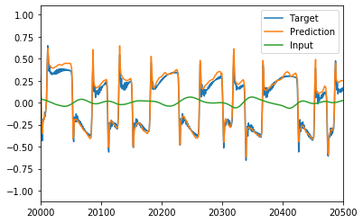

# Tube-Amp-Modeller
A neural network designed to model a guitar tube amplifier inspired by a project by @sdatkinson.

Since Tube Amplifiers typically act non-linearly to the input signal, it becomes an interesting problem to model this using a neural network.

The output signal of the amplifier depends on a 'history' h of input samples:

y<sub>t</sub> = a<sub>1</sub> x<sub>t</sub> + a<sub>2</sub> x<sub>t-1</sub> + ... + a<sub>h</sub> x<sub>t-h</sub>

Hence we need to create a data set that inputs h samples for every 1 output sample.
To do this we use the keras library TimeSeriesGenerator.

The code is written to be executed in an IPython console.

## Training

Various parameters can be set in the code before execution. The standard parameters for the included samples are:
```
history=4096
dense_layers=[1024,512,256,256]
learning_rate=0.001
batch_size=4096
test_size=0.2
```
As standard input it takes 'Samples\input.wav' and for the target 'Samples\target.wav'. Once the code is executed the model can be trained for n epochs using:
```
model.fit_model(n)
```
Once trained, the model can be saved using
```
model.save_model()
```
which saves it to a predetermined folder.

## Amplifying using a trained model

Once a model has been trained and saved it can be used to amplify audio samples. If the model is already/still loaded one uses:
```
reamp(input_file, amp_name)
```
When a model has to be loaded add the location of the model .h5 file using amp_file:
```
reamp(input_file, amp_name, amp_file)
```

## Results


As can be seen in the above plot, the model is able to come close to the target after 200 epochs. Although there's visibly more detail in the target file (more harmonics), this difference seems to be inaudible ben playing back these results. One interesting find is that when skipping every other input signal (reducing the input size) to improve speed, the results are still very good.
